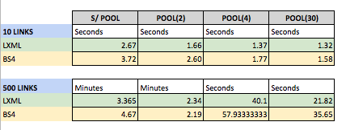

 ## web_parser_profilings
 
 [](https://hub.docker.com/r/gfreire)

This project was oriented to produce a statistical perspective of different parsers tunings. It was created to help register more empirically the parser performance.
For the comparisons, the same main API,network and CPUs were used. Each result
corresponds to the mean of 10 script executions managed by the scheduler
#
##### eg. benchmarking algos using different (n) CPU processes / parser libs 
# 
##### Note that this statical sampling is showing that the request+lxml libs with multiprocessing algorithm perfomed almost *14 times* faster than bs4 with single processing when dealing with 500 URL.
#
### Steps to run:

To install Python modules
```diff
+ $ make modules
```
To run the tests
```diff
+ $ make test
```
To run single process parser and generate csv from results:
```diff
+ $ make lxml
```
```diff
+ $ make bs4
```
To Run multiprocess parser and generate csv from results
```diff
+ $ make p_lxml
```
```diff
+ $ make p_bs4
```

You may run a bash script to automate some iterations. eg:
Call the scheduler to count and redirect each sampling output
```diff
+ $ make schedule
```


